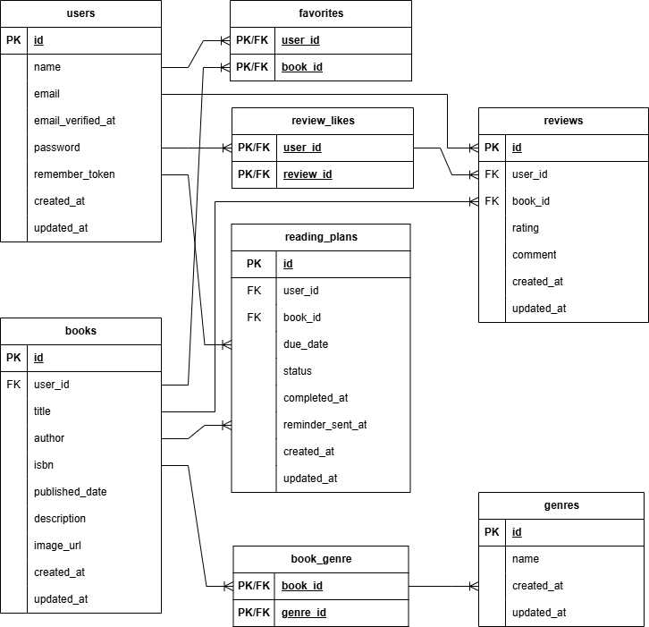

# BookShelf

## 概要

BookShelfは、書籍情報の登録・閲覧・編集・削除、レビュー投稿、お気に入り登録、レビューへのいいね、ジャンル管理、評価ランキング表示を行える書籍レビューアプリです。

Laravelを使用し、認証機能、書籍管理機能、レビュー機能、ランキング機能、書籍APIに加えて、検索・フィルタ機能、Google Books APIを利用したISBN検索、マイ読書レポート、読書計画、通知機能、読書計画リマインダー、SanctumによるAPI書き込み認証を実装しています。

## 主な機能

### 認証機能

- ユーザー登録
- ログイン
- ログアウト

### 書籍機能

- 書籍一覧表示
- 書籍詳細表示
- 書籍登録
- 書籍編集
- 書籍削除
- キーワード検索
- ジャンル絞り込み
- 並び替え
- ISBN検索による書籍情報取得

### レビュー機能

- レビュー投稿
- レビュー編集
- レビュー削除
- レビューへのいいね
- レビューへのいいね解除

### お気に入り機能

- お気に入り登録
- お気に入り解除
- お気に入り一覧表示

### ジャンル機能

- ジャンル一覧表示
- ジャンル登録
- ジャンル詳細表示
- ジャンル編集
- ジャンル削除

### ランキング機能

- 評価ランキング表示

### マイ読書レポート機能

- レビュー数表示
- 読了冊数表示
- 平均評価表示
- 評価分布表示
- 高評価書籍表示
- ジャンル別評価表示

### 読書計画機能

- 読書計画一覧表示
- 読書計画登録
- 読書計画編集
- 読書計画削除
- 読了登録
- ステータス絞り込み

### 通知機能

- 通知一覧表示
- 通知の既読化
- 読書計画の期日通知
- 読書計画の期限切れ通知

### API機能

- 書籍一覧取得
- 書籍詳細取得
- 書籍登録
- 書籍更新
- 書籍削除
- Sanctumによる書き込み系APIの認証

## 使用技術

- PHP 8.5.7
- Laravel 10.50.2
- MySQL
- Docker
- Laravel Sail
- Laravel Fortify
- Laravel Sanctum
- Tailwind CSS
- Alpine.js
- Vite
- Laravel Pint
- PHPUnit

## 環境構築

### 1. リポジトリをクローン

```bash
git clone git@github.com:nagaki813/bookshelf-app.git
cd bookshelf-app
```

### 2. 環境変数ファイルを作成

```bash
cp .env.example .env
```

### 3. Composerパッケージをインストール

```bash
docker run --rm \
    -u "$(id -u):$(id -g)" \
    -v "$(pwd):/var/www/html" \
    -w /var/www/html \
    laravelsail/php82-composer:latest \
    composer install --ignore-platform-reqs
```

### 4. Sailを起動

```bash
./vendor/bin/sail up -d
```

### 5. Sailエイリアスを設定

Sailコマンドを簡単に実行できるように、エイリアスを設定します。

```bash
alias sail='[ -f sail ] && sh sail || sh vendor/bin/sail'
```

毎回設定しなくて済むようにする場合は、`~/.bashrc` に追記します。

```bash
echo "alias sail='[ -f sail ] && sh sail || sh vendor/bin/sail'" >> ~/.bashrc
source ~/.bashrc
```

設定後は、以下のように `sail` コマンドを使用できます。

```bash
sail up -d
sail artisan migrate
sail npm install
```

### 6. アプリケーションキーを生成

```bash
sail artisan key:generate
```

### 7. マイグレーション・シーディングを実行

```bash
sail artisan migrate:fresh --seed
```

### 8. フロントエンド依存関係をインストール

```bash
sail npm install
```

### 9. フロントエンドをビルド

```bash
sail npm run build
```

## 環境変数

`.env` のデータベース設定は以下の通りです。

```env
DB_CONNECTION=mysql
DB_HOST=mysql
DB_PORT=3306
DB_DATABASE=laravel
DB_USERNAME=sail
DB_PASSWORD=password
```

## 開発環境URL

| 内容 | URL |
| --- | --- |
| アプリケーション | http://localhost |
| 書籍一覧 | http://localhost/books |
| ランキング | http://localhost/ranking |
| マイレポート | http://localhost/reports |
| 読書計画 | http://localhost/reading-plans |
| 通知一覧 | http://localhost/notifications |
| phpMyAdmin | http://localhost:8080 |

## phpMyAdmin

phpMyAdminには以下の情報で接続できます。

| 項目 | 値 |
| --- | --- |
| サーバ | mysql |
| ユーザー名 | sail |
| パスワード | password |

## テストユーザー

Seederで以下のユーザーを作成しています。

| 名前 | メールアドレス | パスワード |
| --- | --- | --- |
| 山田太郎 | yamada@example.com | password |
| 鈴木花子 | suzuki@example.com | password |
| 田中一郎 | tanaka@example.com | password |
| 佐藤美咲 | sato@example.com | password |
| 高橋健太 | takahashi@example.com | password |

## APIエンドポイント

書籍APIは以下のエンドポイントを用意しています。

| メソッド | URL | 内容 | 認証 |
| --- | --- | --- | --- |
| GET | /api/v1/books | 書籍一覧取得 | 不要 |
| GET | /api/v1/books/{book} | 書籍詳細取得 | 不要 |
| POST | /api/v1/books | 書籍登録 | 必要 |
| PUT/PATCH | /api/v1/books/{book} | 書籍更新 | 必要 |
| DELETE | /api/v1/books/{book} | 書籍削除 | 必要 |

POST、PUT/PATCH、DELETEはLaravel SanctumのBearerトークン認証が必要です。

### APIトークン作成例

ローカル確認用のAPIトークンは、Tinkerで作成できます。

```bash
sail artisan tinker
```

```php
$user = \App\Models\User::first();
$token = $user->createToken('api-token')->plainTextToken;
$token;
```

表示されたトークンをAPIリクエストの `Authorization` ヘッダーに指定します。

### APIリクエスト例

#### 書籍一覧取得

```bash
curl -i -H "Accept: application/json" http://localhost/api/v1/books
```

#### 書籍詳細取得

```bash
curl -i -H "Accept: application/json" http://localhost/api/v1/books/1
```

#### 書籍登録

```bash
curl -i -X POST http://localhost/api/v1/books \
  -H "Accept: application/json" \
  -H "Content-Type: application/json" \
  -H "Authorization: Bearer <TOKEN>" \
  -d '{
    "title": "API登録テスト書籍",
    "author": "APIテスト著者",
    "isbn": "9784000004000",
    "published_date": "2026-07-16",
    "description": "API登録テスト用の説明です。",
    "image_url": "https://placehold.co/200x300/e2e8f0/475569?text=api",
    "genres": [1]
  }'
```

#### 書籍更新

```bash
curl -i -X PUT http://localhost/api/v1/books/1 \
  -H "Accept: application/json" \
  -H "Content-Type: application/json" \
  -H "Authorization: Bearer <TOKEN>" \
  -d '{
    "title": "API更新後タイトル",
    "author": "API更新後著者",
    "isbn": "9784101010014",
    "published_date": "2026-07-16",
    "description": "API更新後の説明です。",
    "image_url": "https://placehold.co/200x300/e2e8f0/475569?text=api-update",
    "genres": [2]
  }'
```

#### 書籍削除

```bash
curl -i -X DELETE http://localhost/api/v1/books/1 \
  -H "Accept: application/json" \
  -H "Authorization: Bearer <TOKEN>"
```

## 読書計画リマインダー

読書計画の期日に応じて通知を作成するコマンドを用意しています。

```bash
sail artisan reading-plans:check
```

このコマンドでは以下の処理を行います。

- 期日3日前の読書計画に通知を作成
- 期日当日の読書計画に通知を作成
- 期日3日後の読書計画に通知を作成
- 期限を過ぎた読書計画のステータスを期限切れに更新
- 読了済みの読書計画は通知対象外
- 同じタイミングの重複通知を防止

スケジュールには以下の通り登録しています。

```bash
sail artisan schedule:list
```

```text
0 0 * * *  php artisan reading-plans:check
```

## テスト

以下のコマンドでテストを実行できます。

```bash
sail artisan test
```

## コード整形

Laravel Pintでコード整形を確認できます。

```bash
sail pint --test
```

コードを自動整形する場合は以下を実行します。

```bash
sail pint
```

## ER図



## DB構成

主なテーブルは以下の通りです。

| テーブル名 | 概要 |
| --- | --- |
| users | ユーザー情報 |
| books | 書籍情報 |
| genres | ジャンル情報 |
| book_genre | 書籍とジャンルの中間テーブル |
| reviews | レビュー情報 |
| favorites | お気に入り情報 |
| review_likes | レビューいいね情報 |
| reading_plans | 読書計画情報 |
| notifications | 通知情報 |
| personal_access_tokens | Sanctum APIトークン情報 |
| password_reset_tokens | パスワードリセットトークン情報 |
| failed_jobs | 失敗ジョブ情報 |

## 作成者

長岐 宗平
